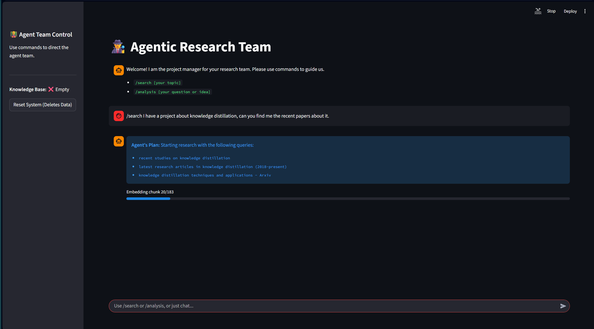
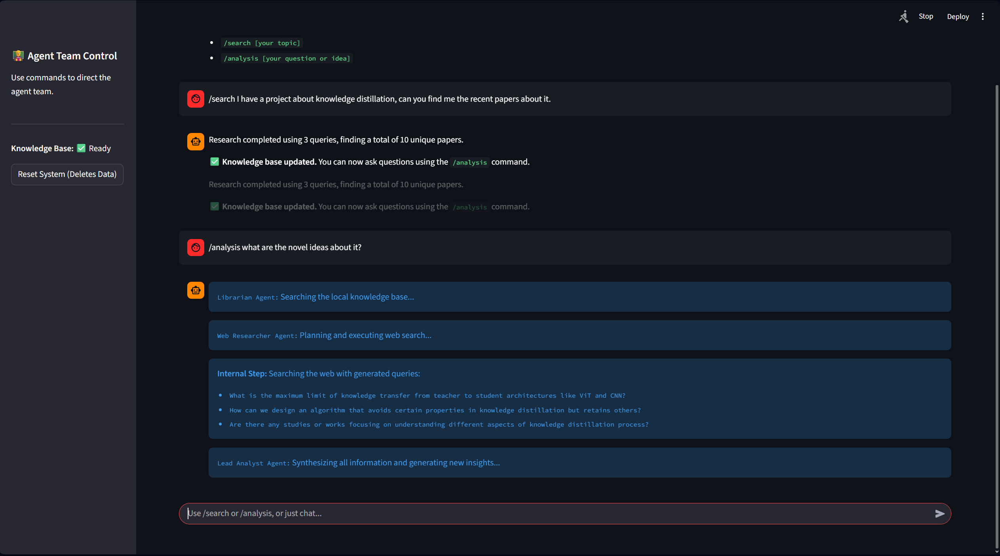
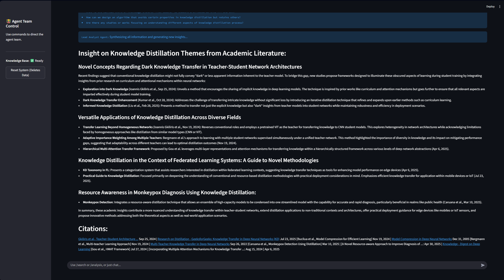
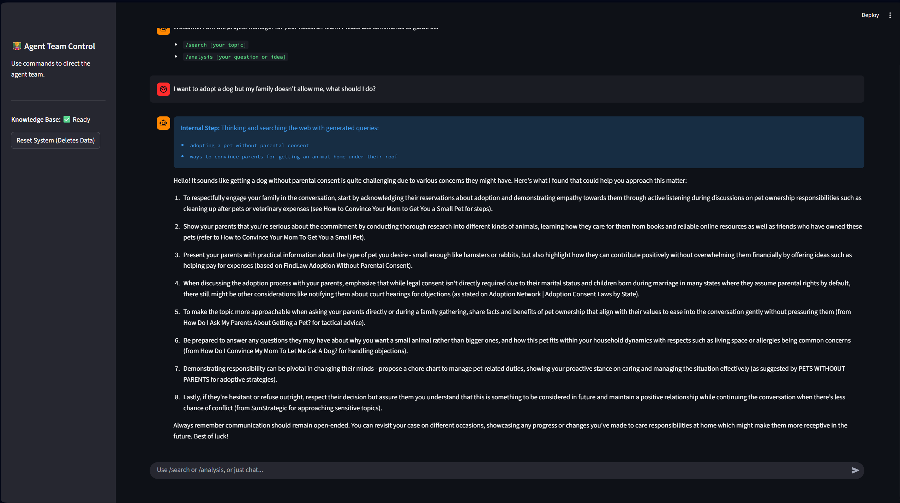
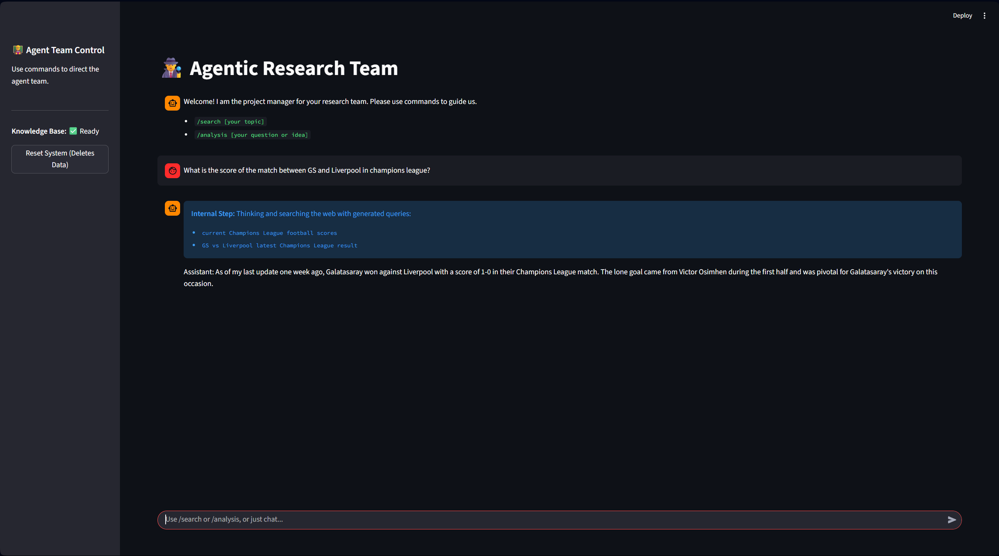

# SARA: Semi-Agentic Research Assistant

This project is an agentic research assistant that searches, extracts, and analyzes academic papers from arXiv using a multi-agent workflow. It combines local paper search, section extraction, vector database (RAG) embedding, and web search to provide synthesized answers to user queries.

## Features
- Search arXiv for papers using custom queries (via arxivxplorer.com)
- Extract structured sections from arXiv papers (using ar5iv.org HTML)
- Embed paper sections into a LanceDB vector database using Ollama embeddings
- Perform RAG (Retrieval-Augmented Generation) search over local papers
- Supplement answers with DuckDuckGo web search
- Multi-agent workflow: Librarian, Web Researcher, Lead Analyst
- Streamlit-based interactive chat UI

## File Overview
- `agent.py`: Main Streamlit app, agent logic, RAG, embedding, and chat interface
- `search_arxiv.py`: Scrapes arxivxplorer.com for papers matching a query
- `extract_paper_sections.py`: Extracts and saves structured sections from arXiv papers using ar5iv.org

## Setup Instructions

### 1. Install Conda (if not already installed)
Download and install Miniconda or Anaconda from [conda.io](https://docs.conda.io/en/latest/miniconda.html).

### 2. Create and Activate Environment
```bash
conda create -n arxiv_agent python=3.10
conda activate arxiv_agent
```

### 3. Install Ollama (for LLM and Embeddings)
- Download and install Ollama from [ollama.com/download](https://ollama.com/download)
- Start the Ollama server:
  - Run `ollama serve` in a terminal

### 4. Install Project Dependencies
```bash
pip install -r requirements.txt
```

### 5. Install Playwright Browsers (for arxiv scraping)
```bash
python -m playwright install
```

### 6. Run the Streamlit App
```bash
streamlit run agent.py
```

## Usage
- Use `/search [topic]` to search arXiv and build the local knowledge base
- Use `/analysis [question]` to analyze and synthesize answers using local and web data
- Or just chat for web-based answers

## Notes
- Ollama must be running for LLM and embedding features
- LanceDB is used for vector storage (no external DB setup needed)
- All data is stored locally in the `arxiv_data` folder

## Requirements
See `requirements.txt` for Python dependencies.

## Troubleshooting
- If scraping fails, check Playwright browser installation
- If embeddings fail, ensure Ollama is running and the required models are pulled (e.g., `ollama pull phi3:3.8b`, `ollama pull embeddinggemma:latest`)
- For Windows users, run commands in Anaconda Prompt or PowerShell

## License
MIT License

---
## Application Walkthrough
Below are example scenarios and screenshots illustrating how SARA works in practice:

### 1. Paper Search, Section Extraction & Embedding
When you search for papers, SARA finds relevant arXiv papers, splits them into sections, and embeds each section into the knowledge base:


*Papers are searched, split into sections, and embedded into LanceDB for semantic retrieval.*

### 2. Agentic Analysis: Knowledge Base + Web Search
When you use `/analysis`, SARA first searches the local knowledge base for relevant information, then generates targeted web queries based on both your question and the local findings. All results are synthesized for a structured answer:


*The agent first searches the knowledge base, then uses the findings to generate web queries, and finally combines all information for a comprehensive answer.*

#### Example Structured Result

*Final output: A well-structured, referenced answer combining local and web knowledge.*

### 3. Normal Chat Mode
You can also chat directly with the LLM, without using any agentic workflow:


*Direct conversation with the LLM*

### 4. Web Knowledge in Chat Mode
In normal chat mode, SARA can also perform web searches to provide up-to-date information:


*The LLM supplements its answers with real-time web search results for current topics.*
